# ⚖️ Régis Bérenger Yao ABALOVI
### *Juriste en Formation | Plaideur & Orateur | Leader Associatif & Entrepreneur*

 
  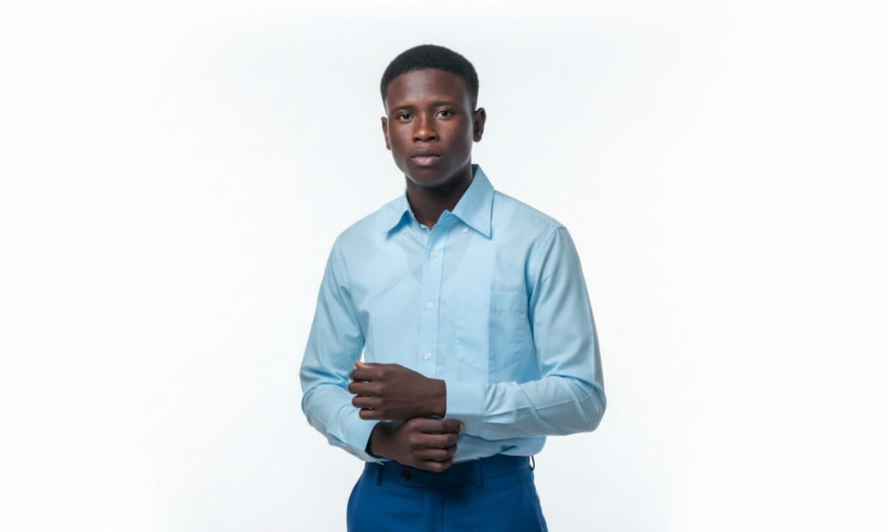

  
  
  
  

---
##  Profil Professionnel
Deuxième année de droit au Bénin, passionné par le contentieux constitutionnel, la vulgarisation du droit. Alliant rigueur académique, compétences poussées en art oratoire et leadership de terrain, je développe des solutions concrètes pour rendre le droit accessible et défendre des causes citoyennes.

---

## Ma Vision
> *"Le droit ne doit pas rester enfermé dans les manuels ou les prétoires ; il doit être un outil vivant d'émancipation, de justice populaire et d'équité sociale."*

En tant que juriste en formation, lauréat de concours de plaidoirie et leader associatif au Bénin, je consacre mon engagement à briser les barrières d'accès à la justice, à défendre les droits fondamentaux des plus vulnérables et à valoriser notre riche patrimoine culturel[cite: 3]. Mon activisme utilise trois leviers majeurs : **le plaidoyer institutionnel**, **l'art scénique engagé** et **l'action humanitaire de terrain**.

---
##  Pôle Éloquence & Plaidoyer (Section Dédiée)
*Cette section met en valeur mes compétences techniques en matière de joutes verbales, de rigueur d'analyse juridique et de maîtrise de l'espace scénique.*

### 🎤 Partage d'Expertise & Mentorat : Journée d'Échanges sur l'Art Oratoire
*Transmission de compétences, animation d'ateliers pratiques et renforcement des capacités au sein de la communauté des jeunes orateurs.*

  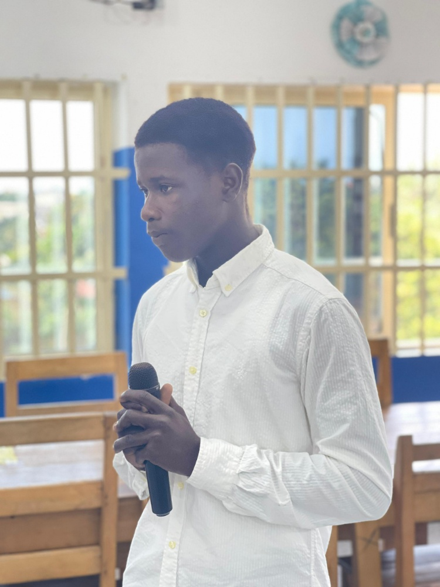
  

* **Facilitation & Transmission de Connaissances :** Animation active d'une session d'échange technique visant à transmettre les clés de la prise de parole en public (gestion du stress, structuration du discours, techniques de captation d'audience) à d'autres pairs et orateurs en formation.
* **Coaching & Direction d'Ateliers :** Supervision d'exercices pratiques et de simulations de joutes verbales, permettant d'apporter des retours constructifs et de guider les participants vers une amélioration de leur posture scénique.
* **Création de Synergies Culturelles :** Consolidation d'un réseau de collaboration entre orateurs pour promouvoir l'excellence oratoire et l'éloquence comme outils d'impact citoyen au Bénin.

  ## 🏆 Pôle Éloquence & Excellence en Plaidoyer (Moot Court & Oratory)
*Cette section met en valeur mes distinctions académiques et techniques en matière de joutes verbales, de rigueur d'analyse juridique et de maîtrise de l'espace scénique.*

### 🥇 Distinctions Majeures — Concours de Plaidoyer « ORATIO PRINCIPIS »
*Compétition de haut niveau simulant des procès sur des problématiques fondamentales du droit pénal et des droits humains.*

  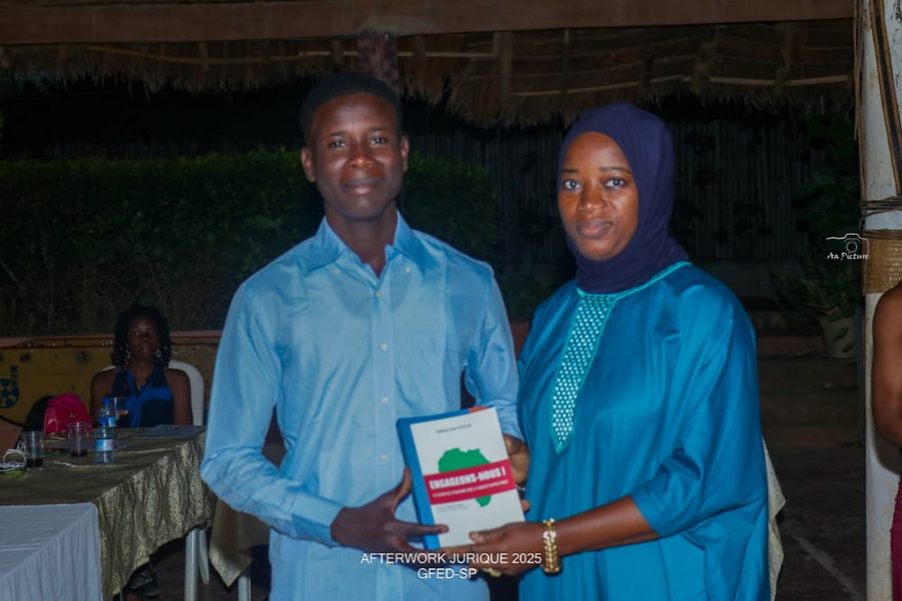
  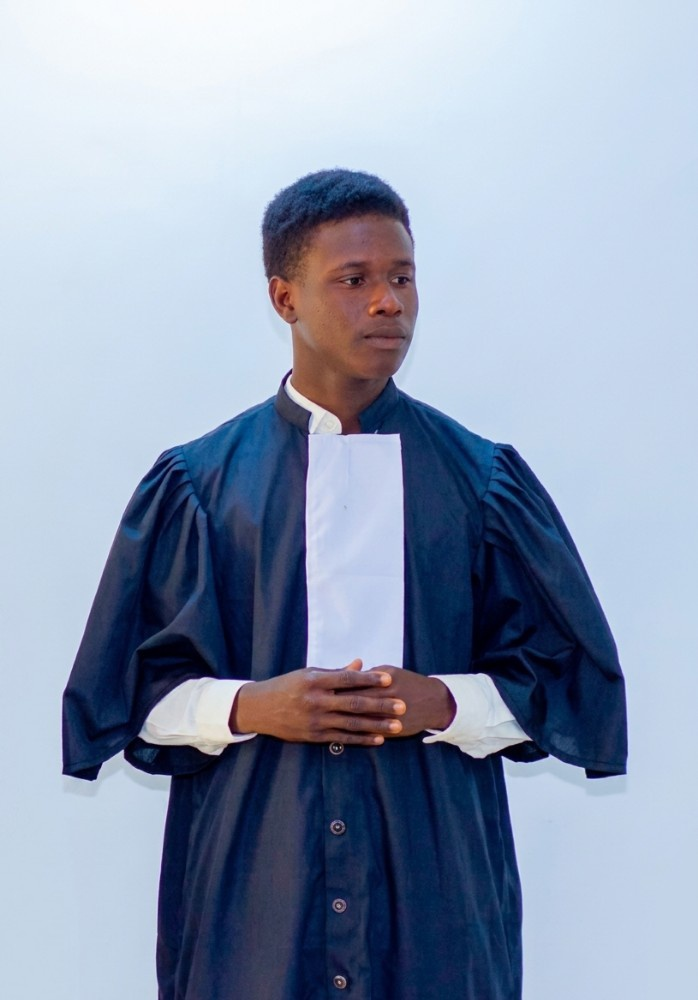
  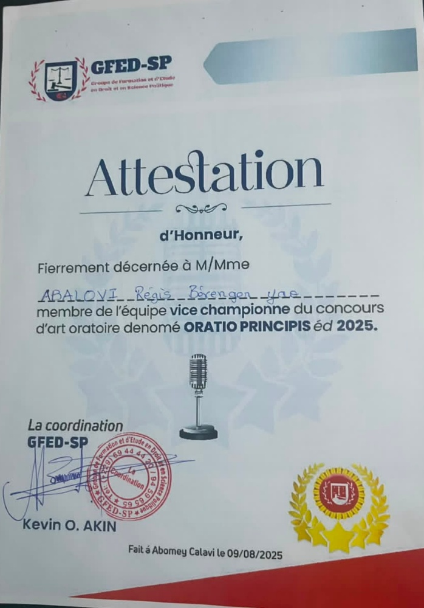

* **Distinction Individuelle — Sacré Meilleur Plaideur du Concours :** Lauréat du **1er Prix Individuel**, récompensant l'éloquence, la force de conviction, la structuration de l'argumentation juridique et la répartie face aux objections du jury.
* **Leadership d'Équipe — Capitaine & Vice-Champion :** Co-capitaine et chef de file d'une équipe solide menée avec succès jusqu'à la phase finale, sacrée **Équipe Vice-Championne** du tournoi.
* **Expertise Thématique & Contentieux Pénal :** Recherche doctrinale approfondie et plaidoiries structurées lors des phases finales et demi-finales sur des thématiques juridiques complexes :
    * *La constitutionnalité et l'éthique de la peine de mort.*
    * *La proportionnalité des peines face à la prison à vie (réclusion criminelle à perpétuité).*

  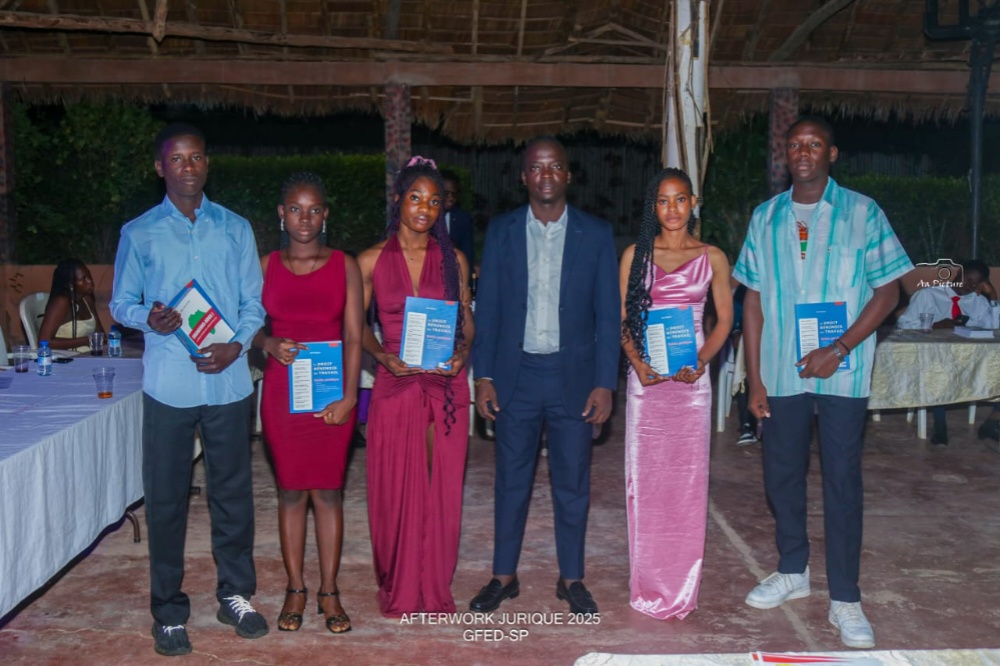
   
  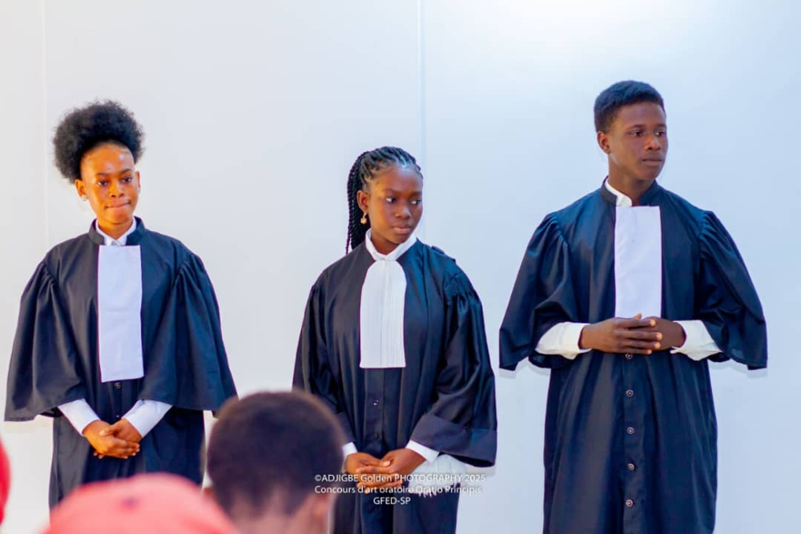
   
  <i>Consécration collective lors de la grande finale d'Oratio Principis.</i>

---

##  Expériences Récentes & Projets Phares

### 1. Action Citoyenne & Contentieux Constitutionnel
  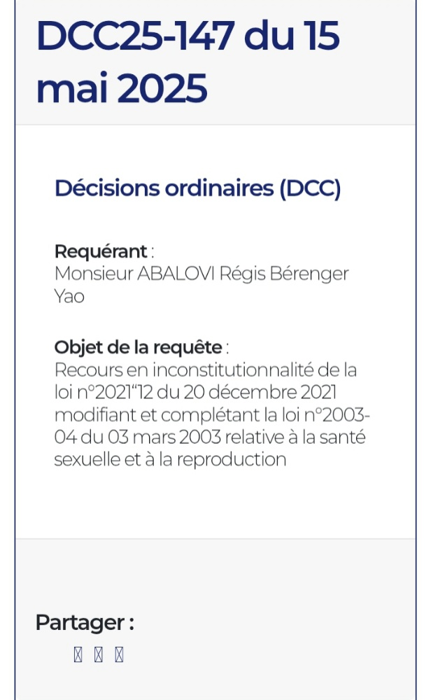
  

*   **Description :** Élaboration et dépôt d'un recours stratégique devant la haute juridiction constitutionnelle du Bénin portant sur l'analyse de la loi réglementant l'avortement.
*   **Objectif :** Garantir et protéger de manière absolue le droit constitutionnel à la vie des nouveau-nés face aux ambiguïtés textuelles.
*   **Status :** Soumis / Action de plaidoyer de haut niveau.
*   **Compétence acquise :** Une procédure complète qui m'a permis de maîtriser la technique de la requête et de voir mon action publiée au Journal Officiel.
*   **Preuves et analyse intégrale:**
    [👉Découvrir le dossier complet, la publication de Google et la décision officielle DCC 25-147](./recours.md) 

###  2. Éducation Populaire : L'Association Théâtre Juridique
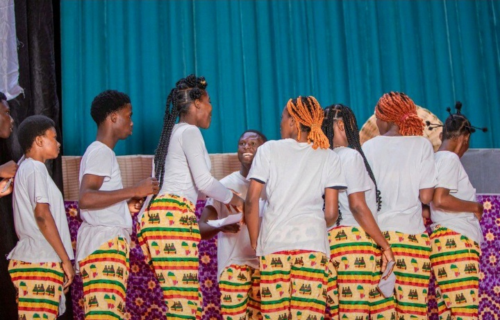

*   **Rôle :** Coordonnateur Général *(depuis septembre 2025)*
*   **Concept :** Tradruire la complexité du droit positif béninois en pièces théâtrales et simulations vivantes pour permettre aux populations et à la jeunesse étudiante de s'approprier et d'exercer leurs droits.
*   **Impact :** Gestion des répétitions, coordination des représentations de sensibilisation et structuration de la visibilité pour l'intégration de nouveaux bénévoles.
*   *   **Preuves et analyse intégrale:**
    [👉 Découvrir la galerie et les coulisses du projet](./theatre_juridique.md) 

  
  ###  3. Droit & Culture : Projet « La Robe Géante »
*   **Rôle :** Conseils, conformité et encadrement des services juridiques.
*   **Description :** Structuration légale et sécurisation des contrats pour une exposition de mode d'envergure nationale visant à promouvoir les artisans et le stylisme béninois.

  ---

##  Projets en cours

###  1. Inclusion Linguistique : Agence de Traduction Juridique (En cours)
*   **Concept :** Création d'une agence spécialisée dans la vulgarisation et la traduction systématique des textes de loi fondamentaux en langues nationales (notamment en **Fon** et **Mina**).
*   **Impact visé :** Éliminer la barrière linguistique pour que la justice parle la même langue que le citoyen.

###  2. Humanitaire & Équité : Projet « Na yi azɔmɛ » *(J'irai à l'école)*
*   **Mission :** Campagne logistique et solidaire de confection et de distribution gratuite d'uniformes scolaires (kaki) pour les enfants issus des zones rurales et reculées du Bénin.
*   **Impact :** Réduction du décrochage scolaire lié aux barrières matérielles et promotion active de l'égalité des chances à l'école.

  ---
  
## 🌐 Conférences, Échanges & Leadership Citoyen (Plenary & General Audience Lectures)
*Participation active à des symposiums et initiatives de haut niveau pour lier l'expertise juridique à l'engagement civique des jeunes en Afrique.*

### 🔍 Événement Phare : Forum « Faire Briller les Droits Humains » (RDVE) — Février 2026
*Implication active au sein d'un espace d'échange interdisciplinaire axé sur les dynamiques de plaidoyer et l'impact civique de la jeunesse.*

  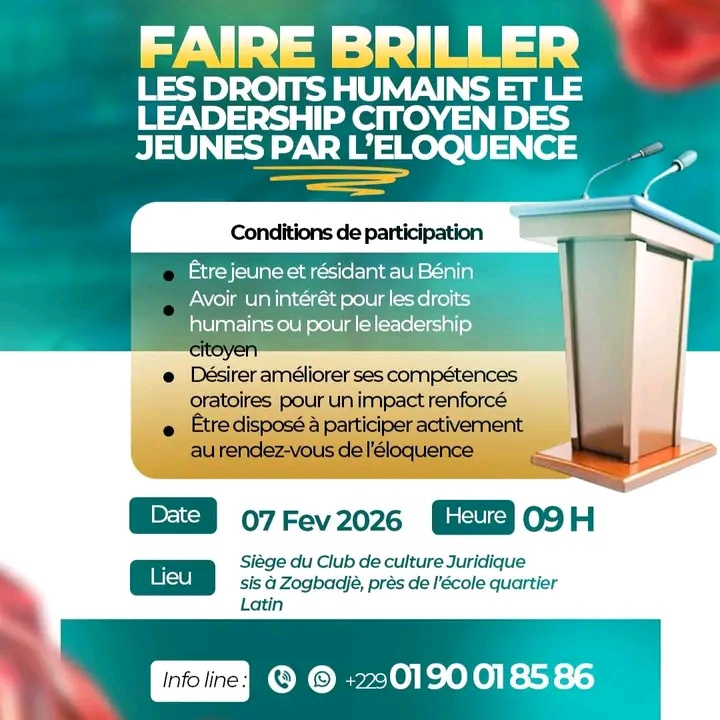
  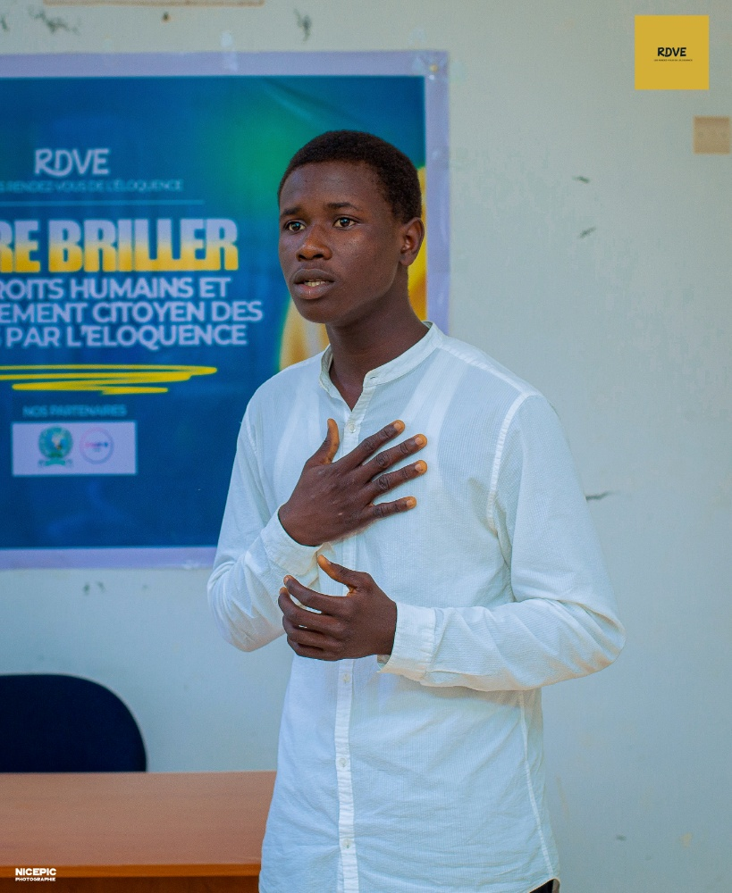

*   **Plaidoyer Scénique & Prise de Parole :** Intervention devant l'assemblée lors de la session plénière pour formuler et délivrer un message d'engagement citoyen structuré, illustrant l'éloquence comme levier d'action.
*   **Veille Thématique Multidisciplinaire :** Suivi et analyse critique des panels animés par 4 experts de haut niveau, articulés autour de quatre piliers fondamentaux :
    1. L'effectivité et la protection des **Droits Humains**.
    2. L'**Éloquence** comme vecteur stratégique de l'engagement civique.
    3. Les fondements théoriques et pratiques de l'**Engagement Citoyen**.
    4. Les modèles de **Leadership d'Impact** pour la jeunesse.
*   **Diplomatie associative & Networking :** Conduite d'échanges bilatéraux lors de la session de réseautage afin de tisser des partenariats et de connecter l'Association Théâtre Juridique avec d'autres dynamiques citoyennes locales.

  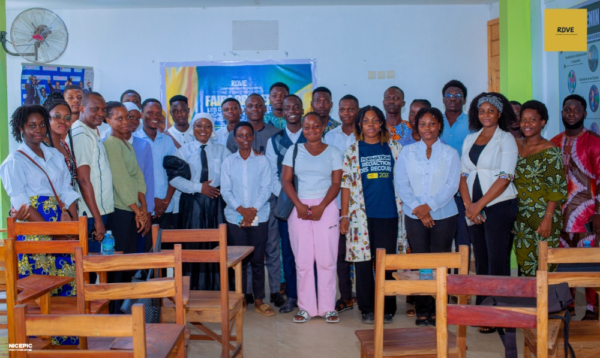
   
  <i>Synergie associative et écosystème de leaders citoyens lors de la session de clôture.</i>

### 🎓 Séminaire de Formation : Plaidoyer International & Gestion de Projets (CFMPDH & CODAP)
*Immersion précoce dans les mécanismes de protection des droits fondamentaux et l'ingénierie de projets citoyens.*

  <a href="LIEN_DE_TA_VIDEO_ICI" target="_blank">
    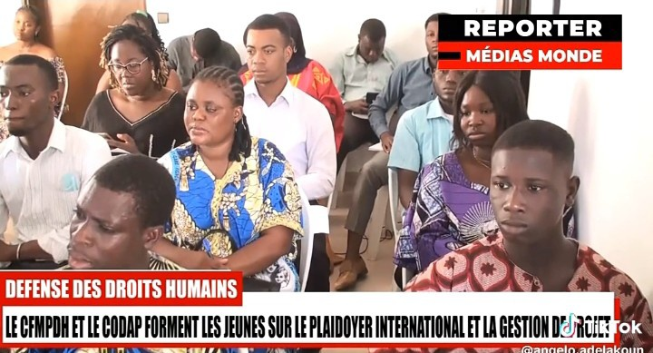
     
    ▼ <i>Cliquez ici pour visionner l'extrait du reportage médiatique</i> ▼
  </a>

*   **Immersion Médias Monde :** Apparition au premier plan lors du reportage télévisé couvrant l'événement, illustrant une présence active au sein des cercles de réflexion juridique dès le début du cursus universitaire.
*   **Module I — Droits Humains & Plaidoyer :** Analyse des outils juridiques internationaux et des mécanismes de défense des libertés publiques (session animée par un panel de 3 experts sectoriels).
*   **Module II — Ingénierie & Gestion de Projets :** Acquisition des bases méthodologiques pour la structuration, le suivi et le financement de projets associatifs à fort impact social (session animée par 2 experts en gestion de projets).

  ## 🤝 Forums, Réseautage & Immersion Entrepreneuriale (Networking & Professional Development)
*Renforcement des compétences transversales, connexions avec l'écosystème entrepreneurial et développement de synergies professionnelles.*

### 🚀 Forum d'Échange & Pitch : « DM ARENA » — Juin 2026
*Participation active à une plateforme multidisciplinaire mêlant leadership, innovation et réseautage stratégique à Cococodji.*

  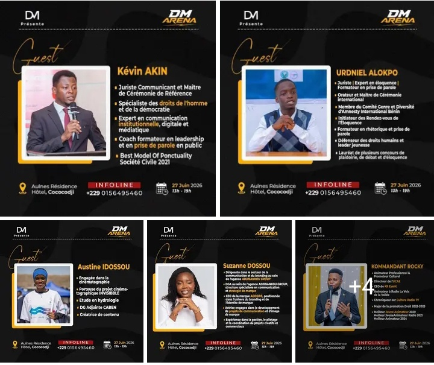
  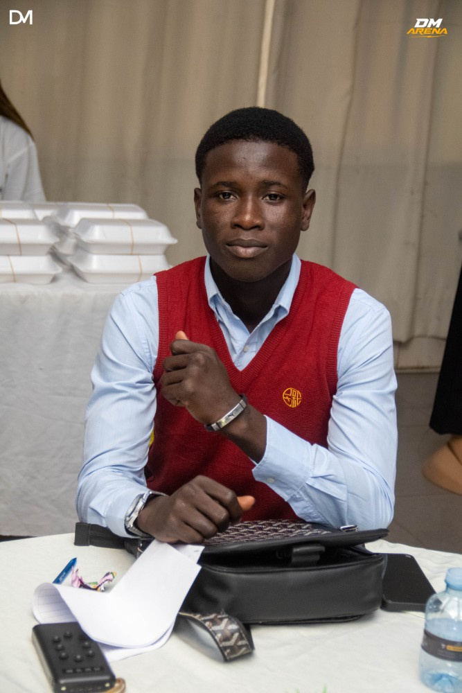

*   **Réseautage Stratégique (B2B Networking) :** Conduite d'échanges directifs avec des entrepreneurs de divers horizons, des experts sectoriels et des communicants institutionnels (notamment des profils liés à la Présidence) afin d'élargir mon écosystème professionnel.
*   **Veille & Compétences Transversales :** Suivi des panels de haut niveau axés sur les leviers stratégiques clés : l'**Éloquence**, le **Leadership d'impact** et les dynamiques de **Développement personnel**.
*   **Analyse de Projets (Pitch Session) :** Observation et évaluation critique lors des concours de présentation de projets, renforçant la compréhension des critères de viabilité et d'attractivité des initiatives entrepreneuriales des jeunes.
*   **Synergie Écosystémique :** Immersion dans le volet culturel et collaboratif (révélation de talents, interactions de groupe) favorisant la cohésion et la création de liens interpersonnels durables.

  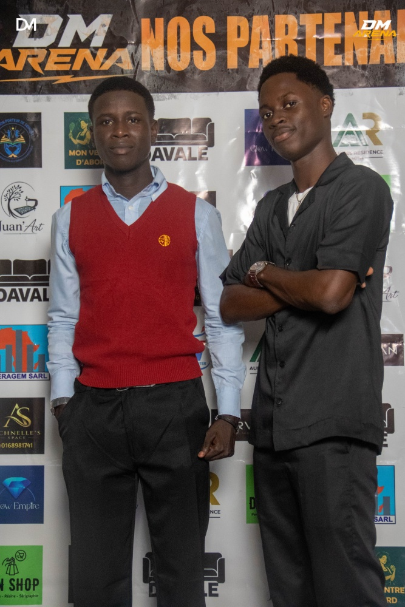
   
  <i>Présence institutionnelle et relations publiques lors de la session de clôture de DM ARENA.</i>

### ⚖️ Table Ronde & Analyse Doctrinale : La Discrimination Positive en Débat
*Échange interactif et approfondi avec les praticiens du droit sur les mécanismes d'équité et de protection des minorités.*

  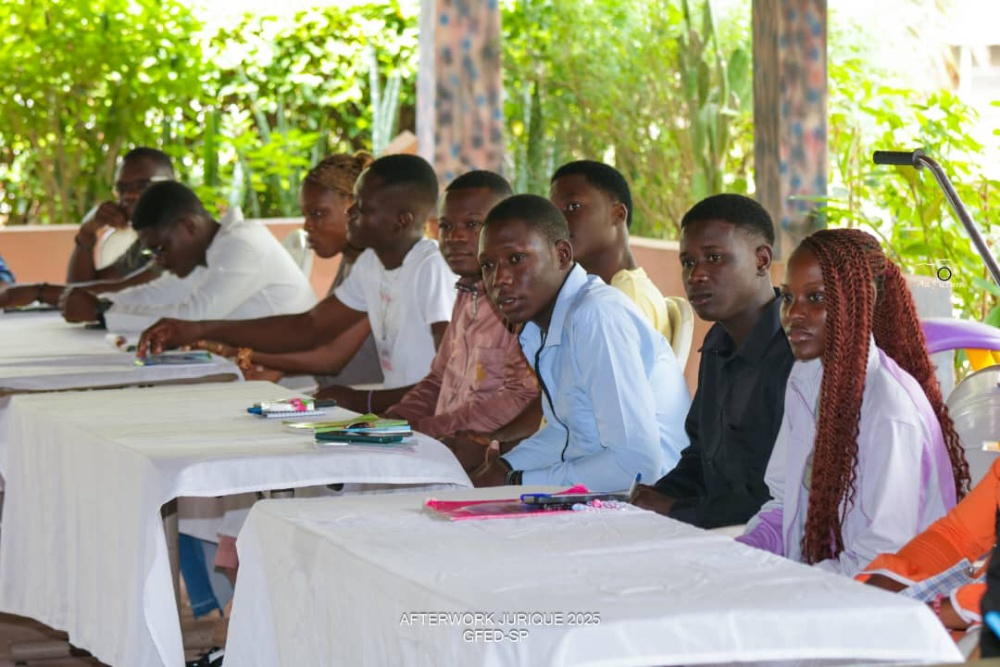
  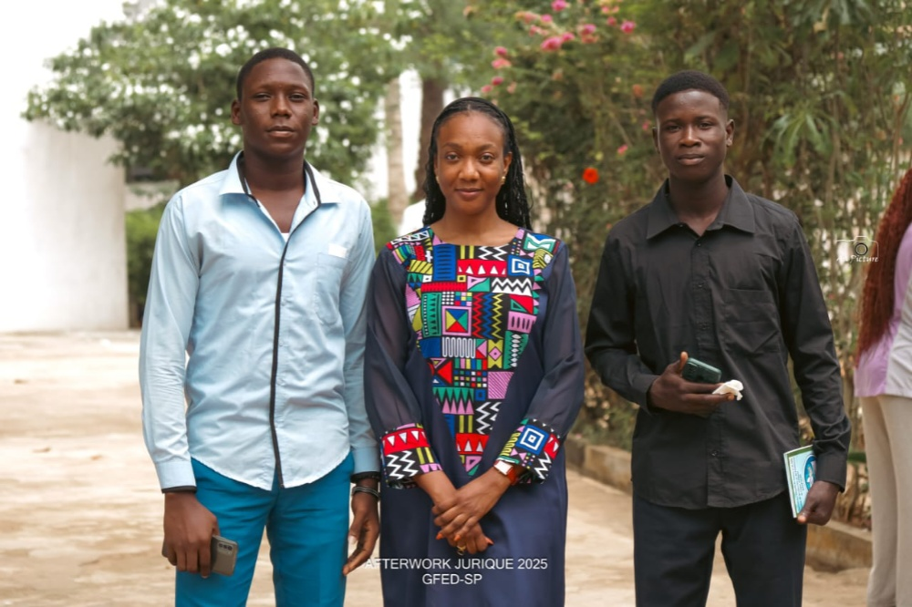

* **Dialogue Clinique avec les Praticiens :** Participation active à une journée d'échanges privilégiée aux côtés de **Maître Marlène**, Avocate au Barreau, portant sur les implications juridiques, éthiques et constitutionnelles de la discrimination positive.
* **Veille et Analyse Conceptuelle :** Étude des cadres théoriques et pratiques visant à corriger les inégalités de départ (accès à l'emploi, éducation, représentativité) à travers des outils juridiques ciblés, tout en analysant les points de tension avec le principe fondamental d'égalité devant la loi.
* **Approfondissement en Droit Public et Humain :** Session de prise de notes stratégique et de débats contradictoires permettant de confronter la doctrine juridique aux réalités sociopolitiques contemporaines en Afrique.

  ### 🏛️ Immersion Institutionnelle : Voyage d'Études au Tribunal de Première Instance de Ouidah
*Compréhension terrain des rouages de la justice républicaine et dialogues cliniques avec les chefs de juridiction.*

  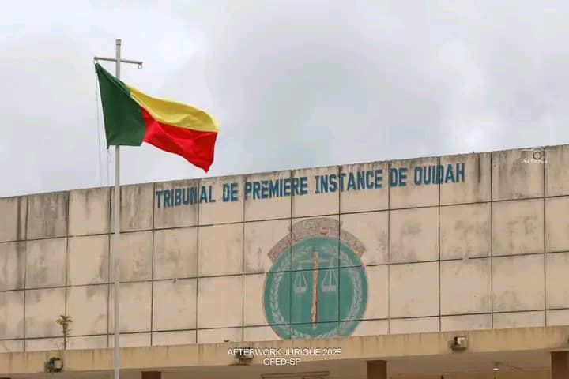
  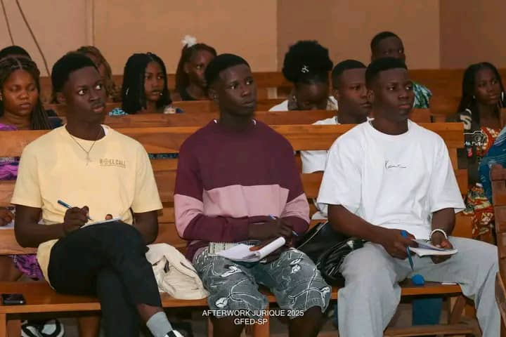

* **Dialogue Stratégique avec les Magistrats et Acteurs Clés :** Participation active à une série d'échanges privilégiés avec les plus hautes autorités de la juridiction :
    * Madame la **Présidente du Tribunal**, portant sur la gestion des audiences et l'application des politiques judiciaires.
    * Le **1er Substitut du Procureur**, abordant la conduite de l'action publique, l'opportunité des poursuites et le rôle du Ministère Public.
    * La **Greffière en Chef**, pour appréhender la sacralité de la procédure, la conservation des actes et la gestion des greffes.
* **Immersion Procédurale :** Visite guidée et observation des infrastructures judiciaires (salles d'audience, bureaux des plaidoiries) permettant de confronter les théories du droit processuel aux réalités des audiences territoriales au Bénin.
* **Professionnalisation & Réseautage :** Renforcement de la posture professionnelle et appropriation des codes déontologiques qui régissent les relations entre les futurs praticiens et les magistrats.
---

##  Compétences clés
*   **Plaidoyer & Droits Humains :** Rédaction de recours juridictionnels, analyse de conformité des lois.
*   **Art de la parole :** Plaidoirie académique, techniques d'éloquence, vulgarisation et expression scénique.
*   **Management associatif :** Leadership d'équipe, planification budgétaire, coordination logistique de projets sur le terrain.
*   **Compétences Linguistiques :** Français (Très bien) | Fon (Langue maternelle, usage professionnel pour la vulgarisation) | Mina.
*   **Gestion de projet github

---

##  Distinctions & Certifications
*    **1er Prix & Attestation de Meilleur Plaideur** — Concours de plaidoirie *Oratio Principis* (2025, GFED-SP Godomey).
*    **Attestation de formation en Rédaction de Recours** (2024, GFED-SP).
*    **Certificat de Maîtrise Informatique** (Microsoft Office, Outils collaboratifs, Réseaux sociaux).

---

## 📬 Me contacter / Suivre mes combats
*   📧 **Email :** abaloviberenger@gmail.com
*   📱 **Téléphone / WhatsApp :** [+229 01 59 12 54 02](tel:+2290159125402) / [+229 01 93 22 46 68](tel:+2290193224668)
*   🌐 **Facebook Pro :** [Profil Régis ABALOVI](https://www.facebook.com/profile.php?id=61578181748603)
*   💼 **Dossier de Candidature :** [Télécharger mon Portfolio Complet en PDF](./portfolio_regis.pdf)

---

<i>"Engagé pour un Bénin où le droit protège, éduque et unit."</i>

