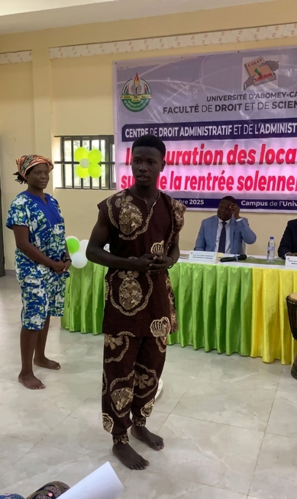
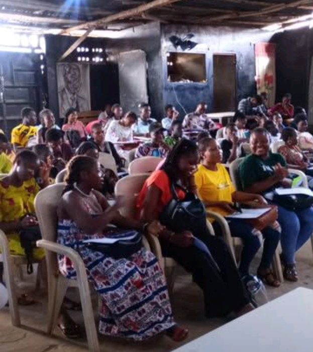

# 🎭 Focus Projet : L'Association Théâtre Juridique
### *Vulgarisation du Droit Positif Béninois par l'Art Scénique et l'Éloquence*

  
  

---

## 🎯 Le Concept : Démystifier la Loi par la Scène
Le droit ne doit pas être une barrière, mais un outil d'émancipation populaire. L'objectif de l'**Association Théâtre Juridique** est de traduire la complexité du droit positif béninois en simulations vivantes, en joutes oratoires et en pièces théâtrales. 

En mettant en scène des situations de la vie quotidienne (conflits fonciers, droits de la famille, violences basées sur le genre), nous permettons aux populations et à la jeunesse étudiante de s'approprier leurs droits et de savoir comment les exercer.

---

## 🚀 Mes Missions en tant que Coordonnateur Général
Depuis ma nomination en septembre 2025, je pilote la structuration opérationnelle et artistique de l'association :
*   **Direction Logistique :** Planification et gestion des séances de répétition des comédiens-juristes.
*   **Coordination des Représentations :** Organisation des tournées de sensibilisation dans les universités et les communautés.
*   **Stratégie de Communication :** Structuration de la visibilité numérique et publique pour attirer de nouveaux bénévoles et partenaires.

---

## 📸 Galerie, Captations & Liens Médias

### 1. L'Art Oratoire au Service du Projet
Mon engagement au sein de ce projet est intimement lié à mon parcours de plaideur, couronné par le **1er Prix** du prestigieux concours d'éloquence et de plaidoirie *Oratio Principis*.

  
   
  <i>L'éloquence et la maîtrise scénique : piliers de notre méthode de sensibilisation populaire.</i>

---

### 2. Le Leadership en Action
Piloter une association de vulgarisation juridique demande une présence constante sur le terrain et une coordination rigoureuse des équipes.

  
   
  <i>Réunion de cadrage et gestion des projets d'éducation populaire.</i>

---

## 🎬 Extrait Vidéo des Sensibilisations
Pour mesurer l'impact de nos simulations juridiques et l'interaction avec le public :

> 📺 **Média disponible :** [▶️ Visionner la représentation théâtrale sur Facebook](https://www.facebook.com/61578181748603/videos/1187539216650055/)

---

## 📊 Impact et Perspectives
*   **Éducation Citoyenne :** Des centaines d'étudiants et de citoyens sensibilisés aux réalités du droit béninois de manière ludique et mémorable.
*   **Ancrage Culturel :** Valorisation des talents artistiques de la jeunesse au service d'une cause sociale et juridique majeure.

---

[↩️ Retour à l'accueil du Portfolio](./index.html)

